 

  <h3 align="center">OpCore Simplify</h3>

  

    A specialized tool that streamlines <a href="https://github.com/acidanthera/OpenCorePkg">OpenCore</a> EFI 自动化配置工具，通过标准化设置流程、自动硬件检测与补丁，极大简化 EFI 制作与维护，降低上手门槛，提升安装成功率。
     
     
    <a href="#-features">功能特性</a> •
    <a href="#-how-to-use">使用方法</a> •
    <a href="#-contributing">参与贡献</a> •
    <a href="#-license">许可证</a> •
    <a href="#-credits">致谢</a> •
    <a href="#-contact">联系方式</a>
  

  
  

    
  

## ✨ **功能特性**

1. **全面支持硬件与 macOS 系统**  
   支持主流电脑硬件。可使用 `兼容性检测` 功能，查询设备兼容性及支持的 macOS 版本。

   | **组件**   | **支持范围**                                                                                       |
   |------------|-----------------------------------------------------------------------------------------------------|
   | **CPU**    | Intel: Nehalem 和 Westmere（第一代）→ Arrow Lake（第十五代/Core Ultra Series 2）   AMD: Ryzen 与 Threadripper，支持 [AMD Vanilla](https://github.com/AMD-OSX/AMD_Vanilla) |
   | **显卡**   | Intel 核显: Iron Lake（第一代）→ Ice Lake（第十代）   AMD APU: Vega Raven ASIC（Ryzen 1xxx → 5xxx, 7x30 系列）   AMD 独显: Navi 23/22/21 及更早型号   NVIDIA: Kepler, Pascal, Maxwell, Fermi, Tesla 系列 |
   | **macOS**  | macOS High Sierra → macOS Tahoe |

2. **ACPI 补丁与 Kext 驱动自动注入**  
   根据硬件配置，自动检测并注入 ACPI 补丁及必需的 Kexts。

   - 集成 [SSDTTime](https://github.com/corpnewt/SSDTTime) 实现常用补丁（如 FakeEC、FixHPET、PLUG、RTCAWAC）。
   - 独家补丁集包括：
      - 避免内核恐慌（引导首个 CPU 到有效内核、禁用 UNC0、创建新 RTC 供 HEDT）。
      - 禁用不支持或闲置 PCI 设备，如显卡（支持 Optimus/Bumblebee/disable-gpu）、Wi-Fi、NVMe 硬盘控制器。
      - 修正 _PRW 方法中的休眠唤醒值（含 GPRW、UPRW、HP 特殊）防止秒醒。
      - 添加 ALS0、BUS0、MCHC、PMCR、PNLF、RMNE、IMEI、USBX、XOSI、Surface Patch 等设备支持。
      - 启用 ALSD、GPI0 设备。
   
3. **一键自动下载与更新**  
   构建 EFI 时，自动检测并下载最新版 OpenCorePkg 及所有 Kext（来源于 [Dortania Builds](https://dortania.github.io/builds/) 和 Github）。

4. **EFI 配置高级定制**  
   集成主流 Hackintosh 经验与实测技巧，自动定制 EFI 配置：

   - 自动伪装部分 AMD 显卡 ID，使 macOS 识别。
   - Intel 混合架构 CPU（P核/E核）自动加载 CpuTopologyRebuild，提高性能。
   - 自动关闭 SIP（系统完整性保护）。
   - 支持 Intel Pentium/Celeron/Core/Xeon 等处理器 ID 伪装。
   - 对 AMD CPU 及 Rocket Lake (11 代+) Intel CPU 添加自定义 CPU 名称。
   - 注入补丁允许不支持的 SMBIOS 启动 macOS。
   - 自动设置 NVRAM，绕过蓝牙芯片检测。
   - 根据实际硬件启用 ResizeAppleGpuBars（可重 缩显存）。
   - 支持同时存在核显与独显时灵活配置（核显头接/驱动、独显插卡）。
   - 强制 Intel 核显 VESA MODE，兼容 HDMI/DVI，便捷安装。
   - 一键兼容 OpenCore Legacy Patcher（OCLP）。
   - 修正网卡“无法连接服务器”、硬盘“内置外置识别错误”等问题。
   - 自动优选电源/性能平衡型 SMBIOS。
   - Ventura 13+ 补丁恢复老款 Intel CPU 睿频/变频电源管理。
   - itlwm 驱动支持自动连接 Wi-Fi 配置文件。

   还有更多贴心细节……

5. **极致可定制化**  
   默认配置已高度完善，用户仍可手动个性调整：

   - 支持自定义 ACPI 补丁、Kext、SMBIOS（**不推荐初学者尝试**）。
   - 强制载入 Kext 驱动以兼容不受支持的 macOS 版本。

6. **中文定制GUI版**
   - 使用原版终端版逻辑重写GUI，可选暗色/亮色主体，安装向导模式逐步进行，也可以随时修改每一步内容选择，整体流程一目了然，最终完成构建OpenCore EFI。 
   - 全部资源打包内置，避免中国用户无法访问github及相关资源或无法下载问题
   - 针对windows和macos打包运行，避免普通用户搭建运行环境困难
   - 打包plist编辑器、硬件检测工具、USB定制工具，全部重写为图形版本，方便国内用户使用

## 🚀 **中国用户使用方法**

1. **下载 OpCore Simplify GUI中文版**:
   - 点击 **Releases** → **Download ZIP/DMG**，或直接访问[MacOS下载链接](https://github.com/btwise/OpCore-Simplify/releases/download/1.0.1/OpCore-Simplify.dmg)/[Windows下载链接](https://github.com/btwise/OpCore-Simplify/releases/download/1.0.1/OpCore-Simplify.zip)。
   - Windows版本解压 ZIP 压缩包至任意文件夹，运行主程序`OpCore-Simplify.exe`。
   - MacOS版本挂载DMG包文件，拖拽`OpCore-Simplify.app`到应用程序文件夹运行

2. **运行 OpCore Simplify**:
   - **Windows** 下直接运行 `OpCore-Simplify.exe`
   - **macOS** 下挂载DMG包后，拖拽 `OpCore-Simplify.app` 到应用程序文件夹后运行
   - **Linux** 下暂未打包实现

   
   

3. **选择硬件报告**:

   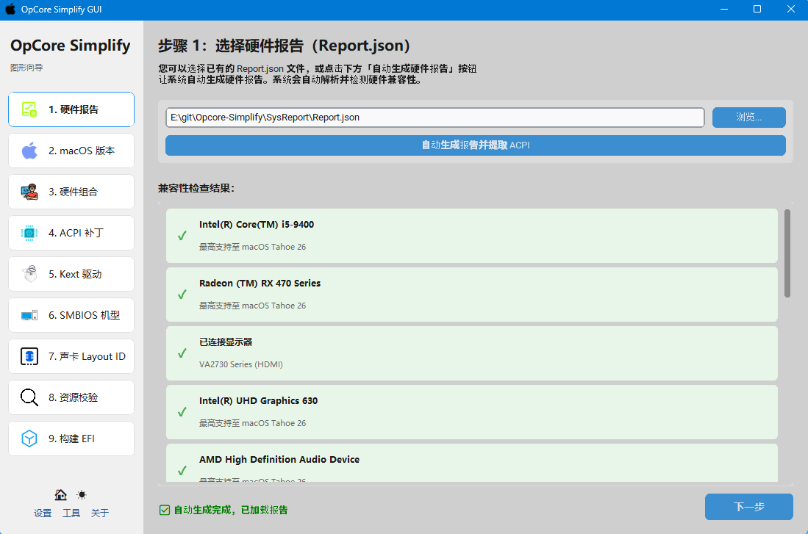

4. **选择MacOS版本**:

   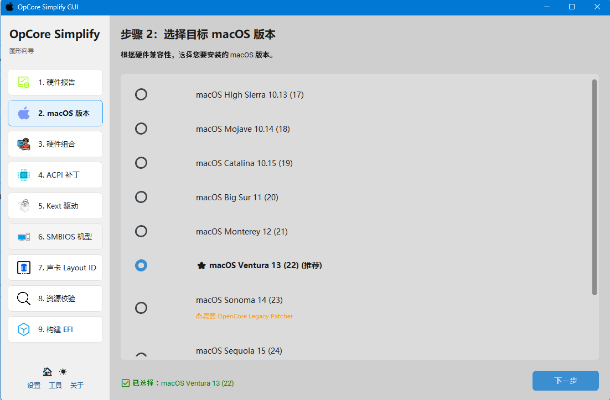

5. **选择显卡定制组合**:
   
   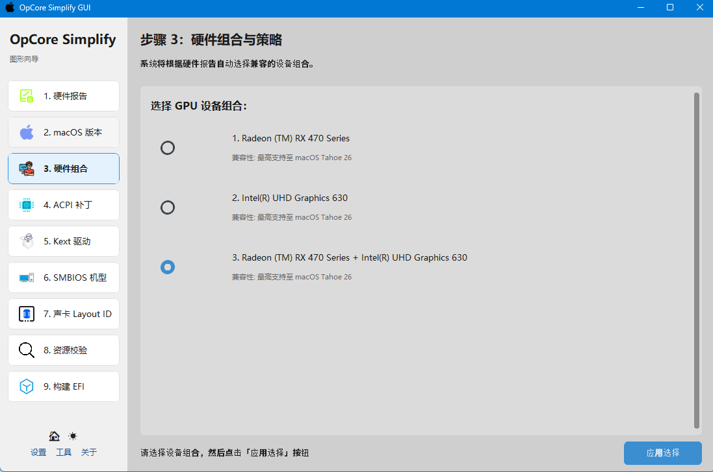

6. **选择ACPI补丁**:

   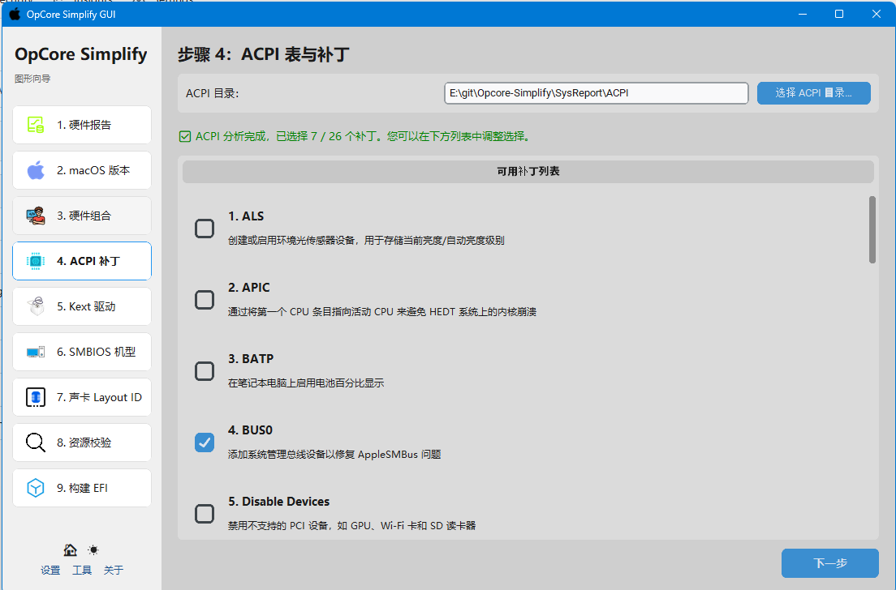

7. **选择SMBIOS机型**:

   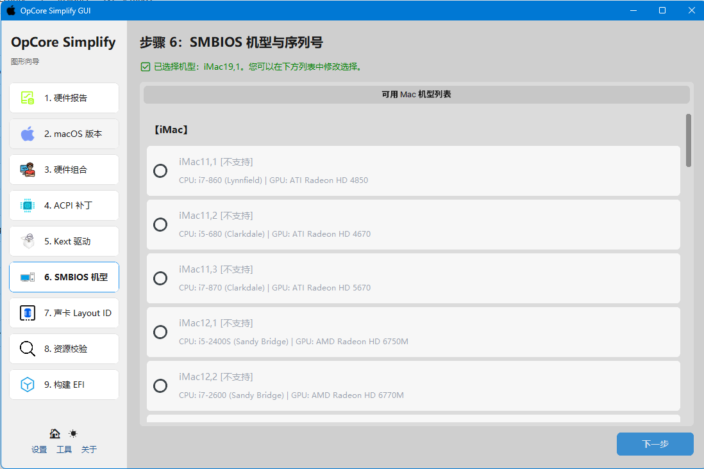

8. **选择kext驱动**:

   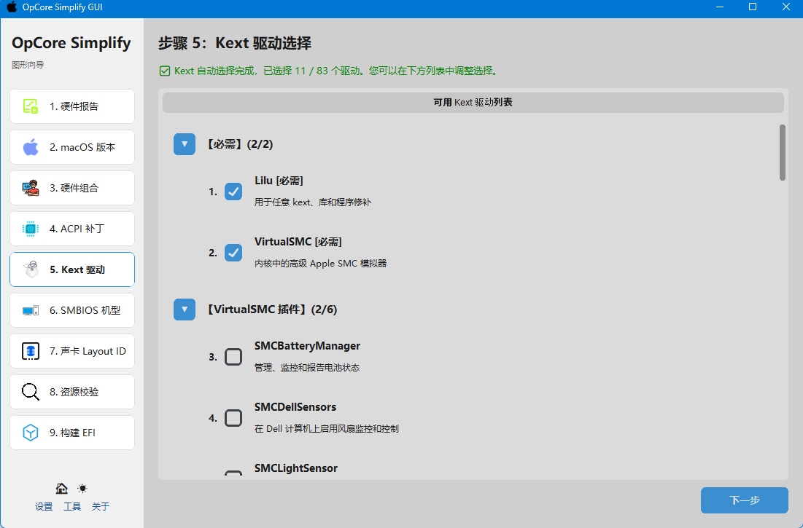

9. **选择声卡layout id**

   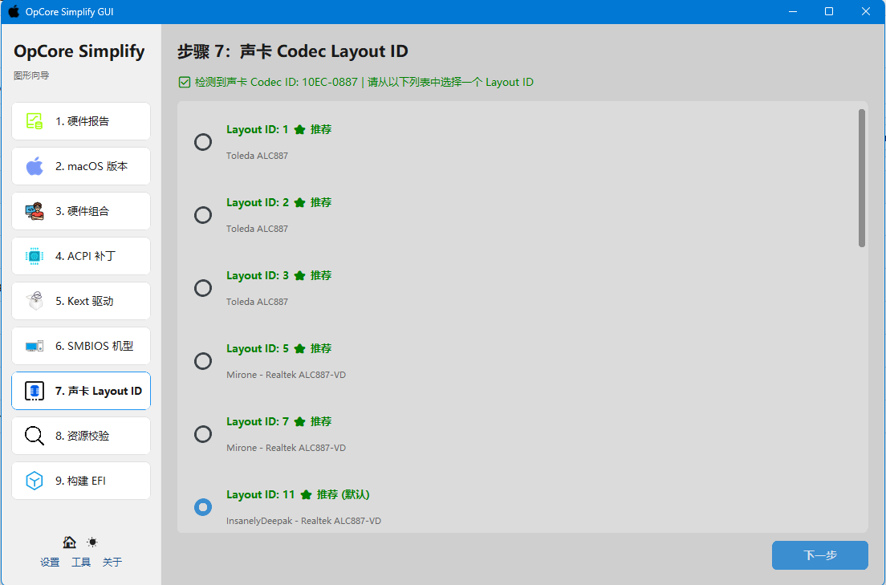

10. **校验所需资源**
   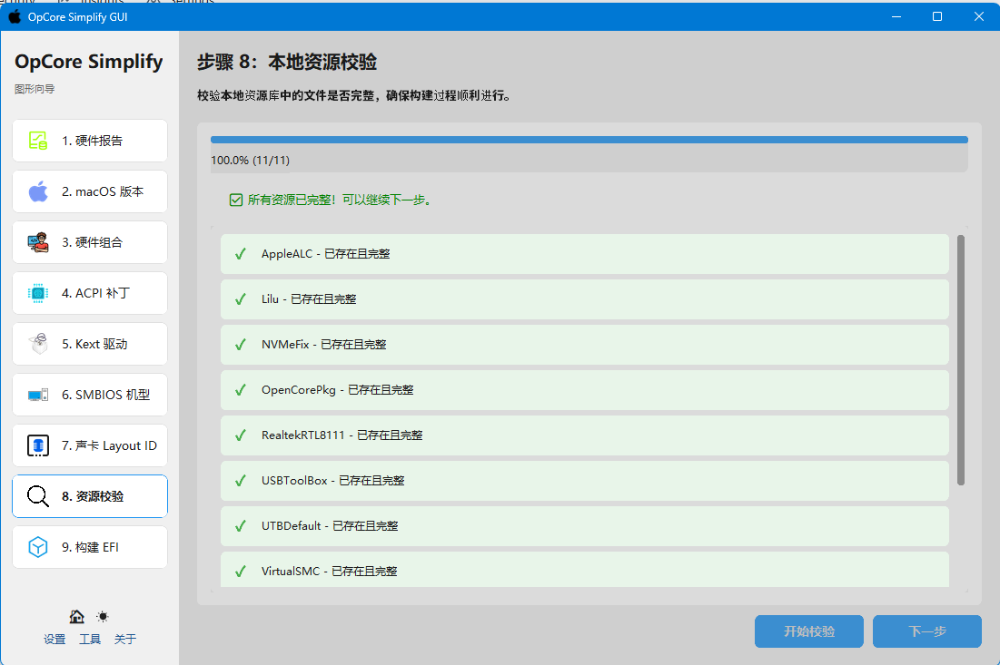

11. **构建EFI**
   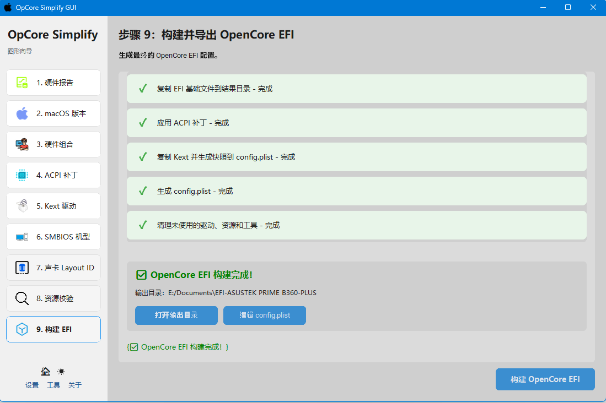

12. **设置界面**

   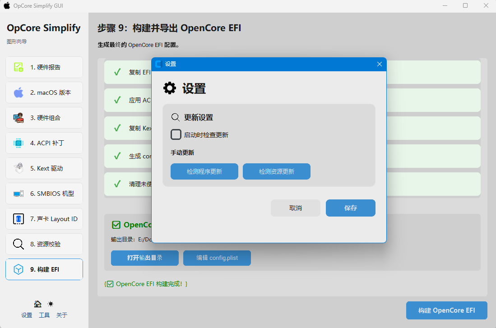

13. **工具菜单**
   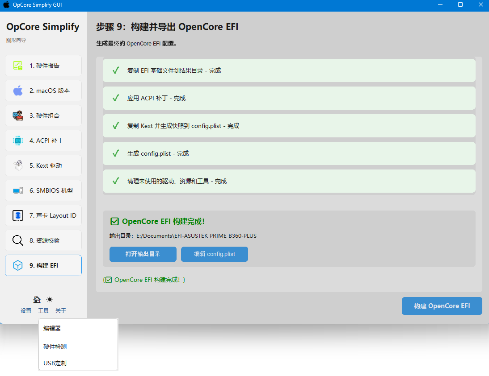

14. **硬件检测工具**

   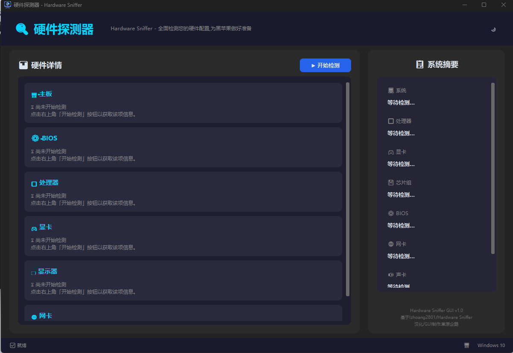

15. **USB定制工具**
   
   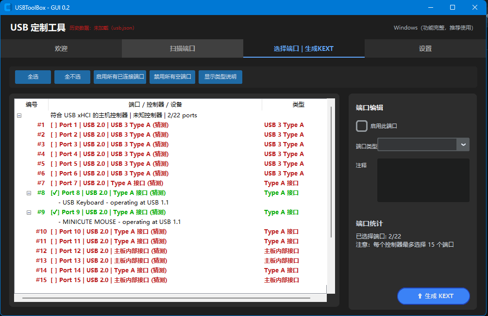

16. **制作启动U盘并安装 macOS**: 
   - Windows 用户推荐用 [**UnPlugged**](https://github.com/corpnewt/UnPlugged) 制作 macOS 启动U盘，或参考[官方教程](https://dortania.github.io/OpenCore-Install-Guide/installer-guide/mac-install.html)（适用于 macOS 环境）。
   - 遇到问题请查阅 [OpenCore 故障排查文档](https://dortania.github.io/OpenCore-Install-Guide/troubleshooting/troubleshooting.html)。

> [!NOTE]
> 1. 安装完成后如需使用 OpenCore Legacy Patcher（OCLP），请直接应用 Root Patch 以激活如新款 Broadcom Wi-Fi、显卡加速等功能。
>
> 2. AMD 显卡用户应用 OCLP Root Patch 后，请移除启动参数 `-radvesa` 或 `-amd_no_dgpu_accel`，否则显卡加速无效。

## 🤝 **参与贡献**

欢迎参与开发！有新点子可以 Fork 本仓库并提交 PR，也可以使用 “enhancement” 标签提交 Issue 建议。

如果本项目有帮助，欢迎点亮 ⭐Star，感谢支持！🌟

## 📜 **许可证**

本项目遵循 BSD 3-Clause License，详见 `LICENSE` 文件。

## 🙌 **致谢**

- [OpenCorePkg](https://github.com/acidanthera/OpenCorePkg) 以及 [Kexts 数据](https://github.com/lzhoang2801/OpCore-Simplify/blob/main/Scripts/datasets/kext_data.py) —— 本项目核心基础
- [OpCore-Simplify](https://github.com/lzhoang2801/OpCore-Simplify) --项目原始仓库
- [SSDTTime](https://github.com/corpnewt/SSDTTime) —— SSDT 补丁工具集
- [@rubentalstra](https://github.com/rubentalstra)：提供 GUI 原型设计与代码实现 [实现可视化界面 #471](https://github.com/lzhoang2801/OpCore-Simplify/pull/471)

## 📞 **联系方式**

**btwise**
> 邮箱: tyq@qq.com
